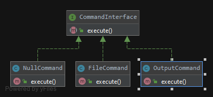

# The Null Object Pattern
A null object is an object with no referenced value or with defined neutral (“null”) behavior. This pattern is used to deal with the absence of an object by providing an alternative that indicates this absence. In short the null object replaces the checking for null values. These classes also adhere to the Open-Close Principle.
##Test
tests/CommandTest.php

