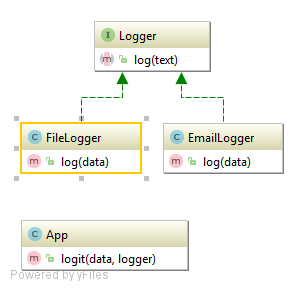

# The Strategy Pattern
Encapsulate a specific family of algorithms (Logger classes), allowing the client class responsible for instantiating a particular algorithm to have no knowledge of the actual implementation.

Logging classes (email, file and database) use:
- Monolog
- Monolog MySQL Handler
##Test
tests/StrategyTest.php

